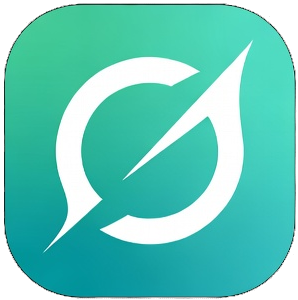
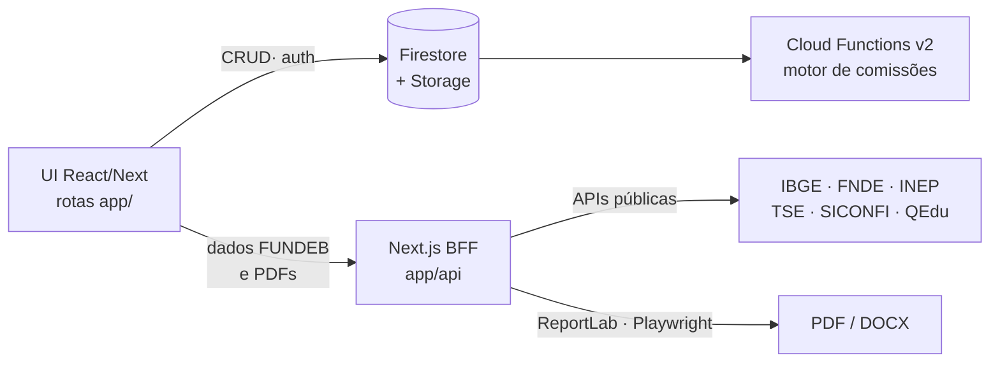

<div align="center">
  

  # Global Sync

  **Plataforma de gestão e automação para consultoria educacional FUNDEB**
  <br />
  Rocha Prime Consultorias

  [](https://nextjs.org/)
  [](https://react.dev/)
  [](https://firebase.google.com/)
  [](https://nodejs.org/)
  [](https://cloud.google.com/run)

  📖 **Documentação completa:** [CLAUDE.md](./CLAUDE.md)
</div>

---

## O que faz

- Gera levantamentos financeiros automáticos de municípios (IBGE, FNDE, INEP, TSE, SICONFI, QEdu, IDEB)
- Produz relatórios técnicos e comerciais para prospecção B2G
- Automatiza a geração de kits documentais de inexigibilidade (Lei 14.133/21)
- Gerencia o pipeline de cidades, contratos, colaboradores e comissões

## Arquitetura em uma frase

O produto **é a interface React sob o Next.js**. A fonte de verdade é o
**Firestore/Storage**, lido direto pelo cliente, e o mesmo Next atua como **BFF** para dados
públicos de FUNDEB e geração de documentos.



> **Houve um app Flutter — não há mais.** Ele foi a interface do produto até a migração para
> o React e **foi removido do repositório**, junto com o bundle em `public/flutter-web/`.
> Para consultar como uma tela antiga funcionava, o código está no histórico do git. URLs
> antigas em `/flutter-web/*` redirecionam para `/entrar`.

## Quick Start

```bash
# 1. Instalar dependências
npm install

# 2. Baixar o Chromium usado na geração de PDF
npx playwright install chromium

# 3. Configurar credenciais
cp .env.example .env.local   # preencher com as credenciais reais

# 4. Rodar o app
npm run dev
```

`npm run dev` sobe o Next na porta 3100 — interface e API no mesmo processo. A aplicação
abre em `/entrar`.

> `.env.example` cobre apenas a configuração do Firebase. As integrações opcionais
> (`QEDU_TOKEN`, `SUPABASE_*`, e `DATABASE_URL`/`DIRECT_URL` do Postgres legado) precisam ser
> adicionadas manualmente ao `.env.local`.

> As telas React leem a config do Firebase em tempo de build do bundle: as seis
> `NEXT_PUBLIC_FIREBASE_*` do `.env.example` precisam estar no `.env.local`, senão o SDK web
> falha no boot e a tela não carrega. As rotas de API não dependem delas.

## Stack

| Camada | Tecnologia |
|--------|-----------|
| Frontend + BFF | Next.js 16.2 App Router, React 19, Tailwind v4, TanStack Query, Node 22 |
| Persistência | Cloud Firestore + Firebase Storage (fonte de verdade) |
| Autenticação | Firebase Auth + custom claims (`groupId`, `groupRole`) |
| Serverless | Cloud Functions v2 (`functions/`) — motor de comissões |
| Documentos | Python 3 + ReportLab 5/Pillow 12, Playwright/Chromium, docxtemplater |
| Infra | Google Cloud Run, Cloud Build, Docker multi-stage |
| Legado | Prisma 6 + Supabase/PostgreSQL — em desativação |

> **Migração ainda em curso: Prisma/PostgreSQL → Firestore.** O CRUD operacional já roda no
> Firestore, mas quatro rotas seguem importando o Prisma (`workspace/settings`,
> `municipalities/[id]` e as duas de `case-de-sucesso`), junto com
> `core/lib/data-access.ts` e `collaboration-data-access.ts`. Enquanto esses imports
> existirem, o build depende de `prisma generate`.

## Estrutura

```
app/(auth)/                   → Telas sem sessão (login)
app/(sync)/                   → Telas com guarda de sessão + shell
core/components/sync-shell/   → Sidebar e header
core/providers/               → AuthProvider (Firebase Auth) + React Query
app/api/                      → Rotas de API (BFF) + geradores PDF em Python
core/                         → Domínio, libs server-side, auth, integrações
modules/                      → Lógica de negócio (FUNDEB, contratos, propostas)
functions/                    → Cloud Functions v2 (comissões sobre Firestore)
kit_padrao_pdf_rocha_prime/   → Estilo compartilhado dos PDFs (ReportLab)
firestore.rules               → Regras de acesso (escopo por grupo via claims)
storage.rules                 → Regras do Firebase Storage
docs/                         → Specs de negócio e roadmaps
scripts/                      → Deploy, dados, manutenção
```

## Testes

```bash
npm test                          # Vitest (core/, modules/) — 343 testes
npm --prefix functions test       # node:test (Cloud Functions)
```

## Deploy

**Uma branch só (`main`), e push é deploy.** Não se cria branch nem se abre PR.

```bash
git push        # dispara o Cloud Build: testes → build → Cloud Run
```

O trigger roda o [`cloudbuild.yaml`](./cloudbuild.yaml) em sequência. **O primeiro passo é a
suíte de testes:** se ela falha, o build aborta e a produção permanece na revisão anterior.
Não há staging — o que passa no gate vai ao ar.

As Cloud Functions têm ciclo próprio: `firebase deploy --only functions`.

Reverter uma revisão ruim:

```bash
gcloud run services update-traffic sync-app --to-revisions=<revisão-anterior>=100 --region=us-central1
```

**Serviço:** `sync-app` · **Projeto GCP:** `opus-sec` · **Região:** `us-central1`
