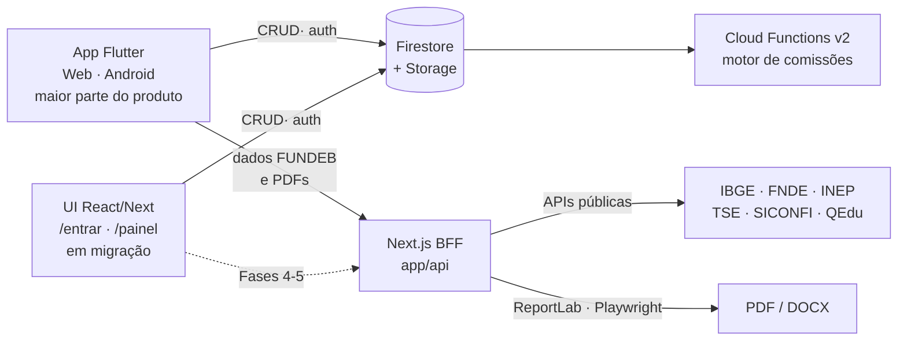

<div align="center">
  

  # Global Sync

  **Plataforma de gestão e automação para consultoria educacional FUNDEB**
  <br />
  Rocha Prime Consultorias

  [](https://nextjs.org/)
  [](https://flutter.dev/)
  [](https://firebase.google.com/)
  [](https://nodejs.org/)
  [](https://cloud.google.com/run)

  📖 **Documentação completa:** [CLAUDE.md](./CLAUDE.md)
</div>

---

## O que faz

- Gera levantamentos financeiros automáticos de municípios (IBGE, FNDE, INEP, TSE, SICONFI, QEdu, IDEB)
- Produz relatórios técnicos e comerciais para prospecção B2G
- Automatiza a geração de kits documentais de inexigibilidade (Lei 14.133/21)
- Gerencia o pipeline de cidades, contratos, colaboradores e comissões

## Arquitetura em uma frase

O produto **é o app Flutter** — e está sendo migrado, tela a tela, para uma interface
**React sob o próprio Next.js**. Nos dois casos a fonte de verdade é o **Firestore/Storage**,
lido direto pelo cliente, e o **Next.js atua como BFF** para dados públicos de FUNDEB e
geração de documentos. Enquanto a migração corre, as duas interfaces convivem na mesma
origem: rotas React explícitas vencem o catch-all, e todo o resto continua sendo servido
pelo bundle Flutter em `public/flutter-web/`.



> **Estado da migração:** Fase 1 concluída — autenticação, shell e painel em React
> (`/entrar`, `/painel`). As demais seções seguem no Flutter e aparecem na navegação React
> marcadas como `LEGADO`, propositalmente não clicáveis: as duas interfaces **não
> compartilham sessão**, e carregar `/flutter-web` derruba a sessão do lado React. O plano
> completo, com as sete fases e os defeitos já corrigidos, está em
> [`docs/superpowers/plans/2026-07-24-migracao-flutter-para-next.md`](./docs/superpowers/plans/2026-07-24-migracao-flutter-para-next.md).

## Quick Start

```bash
# 1. Instalar dependências
npm install

# 2. Configurar credenciais
cp .env.example .env.local   # preencher com as credenciais reais

# 3. Rodar backend + Flutter Web
npm run dev
```

Outros modos: `npm run dev:next` (só a API, porta 3100),
`bash sync_flutter/run_local.sh --no-flutter` (só backend), `--rebuild-web` (reconstrói o
bundle em `public/flutter-web/`) e `--kill` (encerra tudo).

> **Linux desktop não é um alvo suportado.** O app depende de Firebase Auth, Firestore e
> Storage, e o FlutterFire não tem implementação para Linux — nenhum plugin `firebase_*`
> registra para essa plataforma, então o binário compila mas morre no
> `Firebase.initializeApp` antes de abrir a janela. Use Web ou Android.

> `.env.example` cobre apenas a configuração do Firebase. As integrações opcionais
> (`QEDU_TOKEN`, `SUPABASE_*`, e `DATABASE_URL`/`DIRECT_URL` do Postgres legado) precisam ser
> adicionadas manualmente ao `.env.local`.

> As telas React (`/entrar`, `/painel`) leem a config do Firebase em tempo de build do
> bundle: as seis `NEXT_PUBLIC_FIREBASE_*` do `.env.example` precisam estar no `.env.local`,
> senão o SDK web falha no boot e a tela não carrega. As rotas de API não dependem delas.

## Stack

| Camada | Tecnologia |
|--------|-----------|
| Frontend (o produto) | Flutter 3.44 / Dart 3.12 — Web e Android · **em migração para React** |
| Persistência | Cloud Firestore + Firebase Storage (fonte de verdade) |
| Autenticação | Firebase Auth + custom claims (`groupId`, `groupRole`) |
| Frontend novo + BFF | Next.js 16.2 App Router, React 19, Tailwind v4, TanStack Query, Node 22 |
| Serverless | Cloud Functions v2 (`functions/`) — motor de comissões |
| Documentos | Python 3 + ReportLab 5/Pillow 12, Playwright, docxtemplater, pacote `pdf` (Dart) |
| Infra | Google Cloud Run, Cloud Build, Docker multi-stage |
| Legado | Prisma 6 + Supabase/PostgreSQL — em desativação (Fase 5) |

> **Duas migrações correm em paralelo, não confunda:**
> 1. **Prisma/PostgreSQL → Firestore** (backend). O CRUD operacional já roda no Firestore; as
>    rotas Next que ainda usam Prisma estão marcadas `DEPRECATED` e saem junto com
>    `core/lib/data-access.ts` e `collaboration-data-access.ts`.
> 2. **Flutter → React/Next** (interface). Fase 1 concluída; alvo web-only — Android deixa de
>    ser suportado ao fim da migração.

## Estrutura

```
app/(auth)/                   → Telas React sem sessão (login)
app/(sync)/                   → Telas React com guarda de sessão + shell
core/components/sync-shell/   → Sidebar e header da interface React
core/providers/               → AuthProvider (Firebase Auth) + React Query
app/api/                      → Rotas de API (BFF) + geradores PDF em Python
core/                         → Domínio, libs server-side, auth, integrações
modules/                      → Lógica de negócio (FUNDEB, contratos, propostas)
sync_flutter/                 → App Flutter (ainda a maior parte da interface; sai na Fase 7)
functions/                    → Cloud Functions v2 (comissões sobre Firestore)
kit_padrao_pdf_rocha_prime/   → Estilo compartilhado dos PDFs (ReportLab)
firestore.rules               → Regras de acesso (escopo por grupo via claims)
storage.rules                 → Regras do Firebase Storage
docs/                         → Specs de negócio e roadmaps
scripts/                      → Deploy, dados, manutenção
```

## Testes

```bash
npm test                          # Vitest (core/, modules/) — lógica pura
npm --prefix functions test       # node:test (Cloud Functions)
cd sync_flutter && flutter test   # Testes do app
```

## Deploy

```bash
./scripts/deploy/deploy-cloudrun-linux.sh   # Next.js + geradores → Cloud Run
firebase deploy --only functions            # Cloud Functions
```

**Serviço:** `sync-app` · **Projeto GCP:** `opus-sec` · **Região:** `us-central1`
